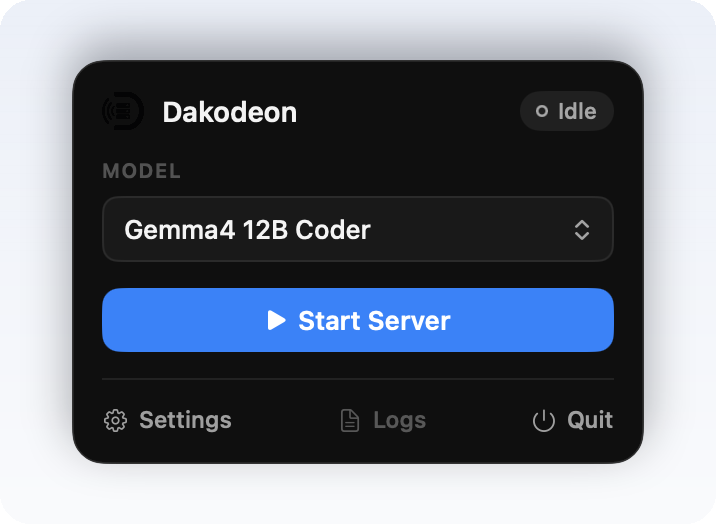
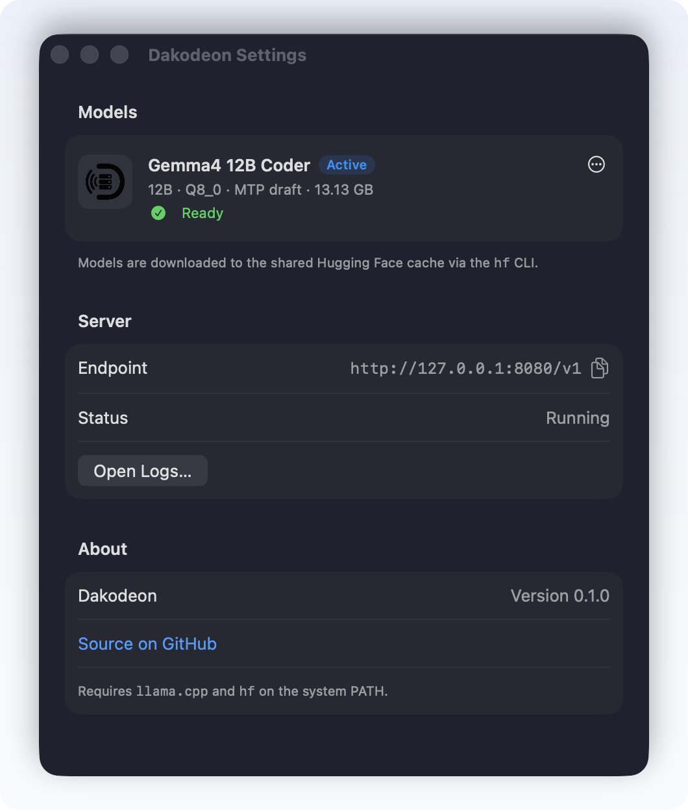

<div align="center">

<picture>
  <source media="(prefers-color-scheme: dark)" srcset="docs/assets/dakodeon-icon-light.png">
  
</picture>

# Dakodeon

**Run local models from your macOS menu bar — behind an OpenAI-compatible API.**

[](LICENSE)
[](#install)
[](Package.swift)
[](https://emin93.github.io/dakodeon/)

[Website](https://emin93.github.io/dakodeon/) · [Install](#install) · [How it works](#how-it-works) · [Develop](#development)

<br>



</div>

---

Dakodeon is a tiny menu bar app. Start a local
[`llama-server`](https://github.com/ggml-org/llama.cpp) router and point any agent — OpenCode,
Zed, or your own scripts — at `http://127.0.0.1:8080/v1`. Your agent chooses the model by id;
Dakodeon shows what's loaded and manages the downloads.

It bundles **no runtime and no weights**. It drives the `llama.cpp` and `hf` tools already
on your machine, so the app itself stays tiny.

## Install

```sh
brew install --cask emin93/tap/dakodeon
```

> [!NOTE]
> **Requirements:** macOS 14+, with `llama-server` and `hf` on your `PATH`.
> ```sh
> brew install llama.cpp
> pip install -U "huggingface_hub[cli]"   # provides `hf`
> ```

## Features

|  |  |
| :-- | :-- |
| 🧭&nbsp; **Menu bar control** | Start/stop the server and see the active model from a slim panel. |
| 📦&nbsp; **Model manager** | A Settings window shows each model's download status — download, cancel, delete, or reveal weights in Finder. |
| 🔄&nbsp; **Selection in your agent** | Clients like OpenCode select a model by id; `llama-server` routes to that profile and keeps one loaded at a time. The app has no model picker. |
| 💤&nbsp; **Idle model sleep** | The router stays online, loads models on demand, and unloads model memory after inactivity. |
| 🧹&nbsp; **Clean shutdown** | Quitting the app stops `llama-server`. |
| 🚀&nbsp; **Native defaults** | `llama-server` loads each model's trained context and embedded chat template. |
| 🧩&nbsp; **Curated assets** | Profiles can include weights, draft models, vision projectors, and tuned `llama-server` flags. |

<div align="center">

</div>

## How it works

Dakodeon launches `llama-server` in router mode and exposes the standard
OpenAI-compatible endpoints. `GET /v1/models` returns the available profile ids,
such as `gemma4-26b-a4b-it-qat` and `ornith-1.0-35b`. Chat requests route by the
JSON `model` field, so switching models in a client like OpenCode also moves the
active model Dakodeon shows in the menu.

The router process is designed to stay up for long sessions. Dakodeon starts it with
on-demand model loading and a five-minute idle sleep window: the model process and
KV cache are released after inactivity, while the OpenAI-compatible endpoint remains
available and reloads the requested model on the next task. The menu and Settings
window show whether the active model is loaded, loading, sleeping, or unloaded.

```http
POST http://127.0.0.1:8080/v1/chat/completions
GET  http://127.0.0.1:8080/v1/models
```

Model files download to the shared Hugging Face cache via `hf`; the app resolves the
local GGUF paths and points the server at them — nothing is copied or duplicated.
Sizes and LFS hashes come from `hf models list <repo> -R --json`. Models are shown by
their Hugging Face repository — the same id clients send.

## Models

Profiles are curated in code at
[`Sources/Dakodeon/Catalog.swift`](Sources/Dakodeon/Catalog.swift). Each `ModelProfile`
declares its weights, an optional draft / MTP model, an optional vision projector, an optional chat template, and any extra `llama-server` flags.
The app exposes **no per-user configuration** — to add a model, append an entry:

```swift
ModelProfile(
  id: "ornith-1.0-35b",
  weights: ModelAsset(repo: "deepreinforce-ai/Ornith-1.0-35B-GGUF", file: "ornith-1.0-35b-Q4_K_M.gguf"),
  draft: nil,
  mmproj: nil,
  chatTemplate: ModelTemplates.ornith,
  extraArguments: ["-ngl", "999", "--reasoning-format", "deepseek"]
)
```

**Bundled today**

| Profile | Quant | Draft | Vision | Download |
| :-- | :-- | :-- | :--: | --: |
| [Gemma 4 26B A4B IT QAT](https://huggingface.co/unsloth/gemma-4-26B-A4B-it-qat-GGUF) | UD-Q4_K_XL | MTP | ✓ | 15.69 GB |
| [Ornith 1.0 35B](https://huggingface.co/deepreinforce-ai/Ornith-1.0-35B-GGUF) | Q4_K_M | - | - | 21.17 GB |

Ornith uses its Hugging Face chat template with a small Codex compatibility patch:
`developer` messages are rendered as system messages, and system messages are not
required to appear only at index zero. Thinking remains enabled; `llama-server`
is started with `--reasoning-format deepseek` so `<think>` content is returned as
structured reasoning instead of being printed in the assistant answer.

## Development

```sh
make run     # build, package, and launch the .app
make dist    # build the signed Dakodeon.app bundle
make zip     # build dist/Dakodeon.zip (release artifact)
```

### Source layout

| File | Responsibility |
| :-- | :-- |
| [`Catalog.swift`](Sources/Dakodeon/Catalog.swift) | Curated model profiles + types |
| [`ModelStore.swift`](Sources/Dakodeon/ModelStore.swift) | Download / delete / status via the `hf` cache |
| [`ServerController.swift`](Sources/Dakodeon/ServerController.swift) | `llama-server` lifecycle, active-model sync, shutdown |
| [`MenuView.swift`](Sources/Dakodeon/MenuView.swift) | The menu bar panel |
| [`SettingsView.swift`](Sources/Dakodeon/SettingsView.swift) | Model-management window |
| [`DakodeonApp.swift`](Sources/Dakodeon/DakodeonApp.swift) | App entry, scenes, and icons |

## License

[MIT](LICENSE) for the app. Model weights remain under their own licenses — the bundled
Gemma profile follows the [Gemma Terms of Use](https://ai.google.dev/gemma/terms).
